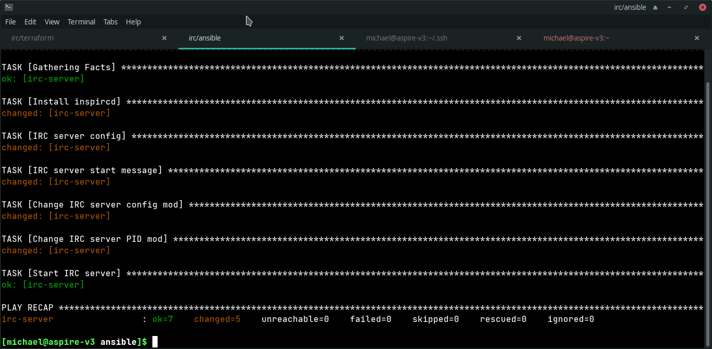
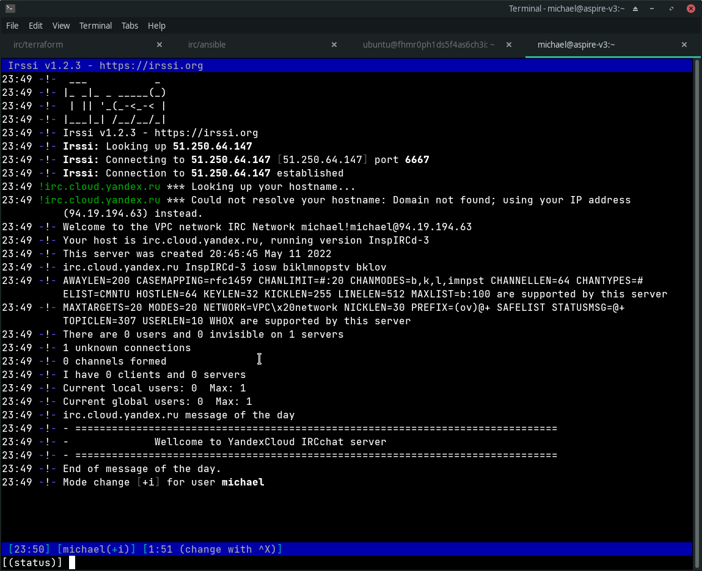
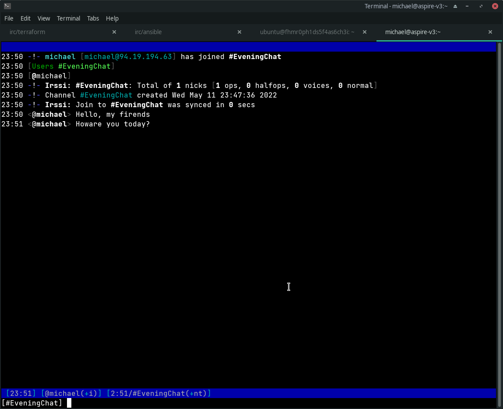

# Развёртывание IRC чат сервера в облачном сервисе

## Введение

В работе проведено развёртывание чат сервера IRC в реализации InsiRCd в облачном сервисе Yandex Cloud.

Инфраструктура сервиса разрботана и реализована при помощи инструмента Terraform.

Настройка инфраструктуры и развёртывание сервиса проведено инструментом Ansible.

## Создание облака

В сервисе Yanex Cloud создано облако irc-server-cloud c одним каталогом irc-server-folder.

## Описание инфраструктуры

VPC сеть main-network содержит одну локальную виртуальную подсеть main-subnet 192.168.10.0/24 в зоне доступности ru-central1-a.

В сети main-network подсети main-subnet создана виртуальная машина с операционной системой Ubuntu 20.04 LTS.

### Характеристики виртуальной машины
- Название irc-server
- OC Ubuntu 20.04 LTS
- 2x CPU Intel Broadwell
- 2 Gb RAM
- 5 Gb HDD
- Внутренний интерфейс с статическим адресом 192.168.10.10
- NAT мост с внешним статическим адресом 54.250.64.147

Для доступа квиртуальной машине с рабочей станции сгенерирована пара RSA ключей, публичный ключ передан в метаданные конфигурации машины.

Описание инфраструктуры находиться в файле terraform/irc-server.tf. Для работы с сервисом Yandex Cloud установлен и подключен провайдер.

## Настройка инфраструктуры и развёртывание сервиса

Реализация IRC чат-сервера InspiRCd представлена программой-демоном inspircd и поставлется в ubuntu пакете.

Настройка сервера производится в файле inspircd.conf. Конфигурирцемые параметры:
- Название сервера
- Ник администратора
- Параметры сервисной перезагрузки и выключения сервера
- Адрес и портсервера
- Конфигурация подключений: разрешённые адреса, макс. количество подключений, ограничения по флуду и частота пинга клиентов чата.
- Путь к PID файлу демона сервера
- Путь к файлу с приветственным текстом inspircd.motd

Файлы конфигурации inspircd находяться в папке inspircd.

Для настройки инфраструктуры и развёртывания при помощи Ansible произведены следующие шаги:

1. Написан файл инвентаря ansible/inventary.ini Ansible с указанием настраиваемого узла, пользователя для входа, путь к публичному RSA ключу.
2. Написан ansible playbook со сценарием настройки и развёртывания ansible/irc-server.yaml
3. Предварительные шаги сценария:
    1. Группа настраиваемых узлов - webservers
    2. Пользователь для входа через SSH - ubuntu
    3. Повышение прав до root - включено
4. Шаг Install inspircd. Обновление кэша индекса репозитория Ubuntu. Установка пакета inspircd.
5. Шаг IRC server config. Копирование заранее написанного конфигурационного файла с рабочей станции в соответствующую директорию inspircd.
6. Шаг IRC server start message. Копирование заранее подготовленного приветственного сообщения в соответствующую директорию inspircd.
7. Шаг Change IRC server config mod. Смена прав доступа для папки конфигурации.
8. Шаг Change IRC server PID mod.  Смена прав доступа для PID фала демона.
9. Шаг Start IRC server. Запуск демона.

## Демонстрация работы сервиса

Выполнение ansible playbook.

Подключение из псевдографического IRC клиента на рабочей станции к IRC серверу в Yandex Cloud через публичный IP. На рисунке видна приветственная надпись, сконфигурированная при развёртывании.

Создание чат-канала EveningChat и отправка тестовых сообщений.

